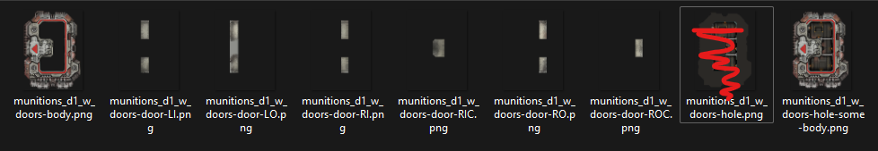
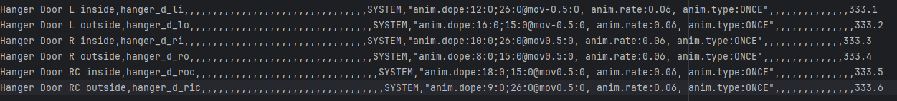

# Starsector MOD - Puppeteer Library

v0.1

## Description

This is a library for controlling complex animations with tags rather than needing either excessive frame animation or bespoke one off class animation controls
*a better discription will come later.

### How it works:
Decoration Weapon is created like normal with "everyFrameEffect":"data.scripts.weapons.effects.DecoAnimated", 

The first time DecoAnimated is called by an object it sets up the animation data only once, then executes based on the rules.
  
From the example the doors open based on a set of rules.

Lets read these instruction from the weapon tags "anim.dope:12:0;26:0@mov-0.5:0, anim.rate:0.06" 
> anim.dope:12:0;26:0@mov-0.5:0

Tag Prefix "anim.dope:" Create a dopesheet (dopesheets were used by to 2d animators for frame timing, also know in film as exposure sheets) 
<ins>First instruction</ins> "12:0" for 12 frames us the image 0 from the sequence 
<ins>Instruction Separator</ins> ";" 
<ins>Second instruction</ins> "26:0@mov-0.5:0" for 26 frames us the image 0 from the sequence AND execute a Move of -0.5 pixels

### Example

#### Only 7 images for the Decoration Slots + the hull

## Thanks to Wisp
Author of https://github.com/wispborne/Starsector-IntelliJ-Template
Debugging would not have been possible without Starsector-IntelliJ-Template project